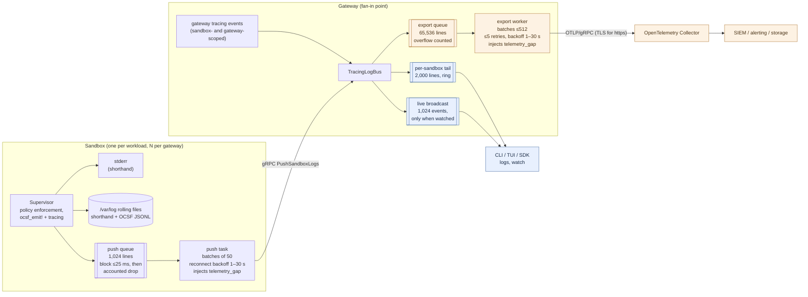
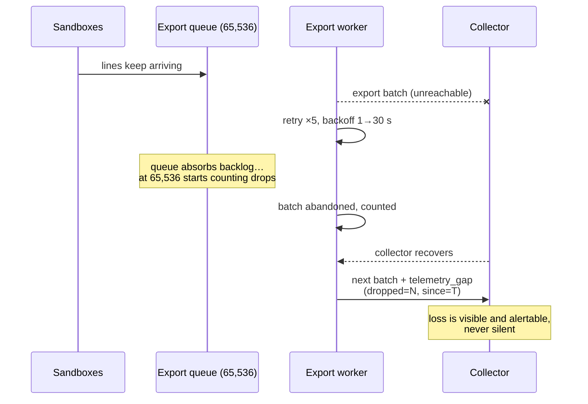

# Logging & Observability

This is the canonical overview of how operational telemetry — logs, OCSF
security events, traces, and metrics — moves through OpenShell: what is
collected, where it flows, what delivery guarantees each hop makes, and how to
choose a configuration. If you are deciding how to get security telemetry out
of OpenShell and into your collector or SIEM, start here.

> **Not to be confused with product telemetry.** OpenShell also emits
> anonymous, aggregate product-usage telemetry (opt-out, documented in the
> [main README](../README.md#telemetry)). This document is about *your*
> operational and security data: sandbox logs, policy decisions, and security
> events. That data goes only where you configure it to go.

## The model: visibility and export are different products

Every log line in OpenShell serves two different consumers with different
needs, and the pipeline treats them as two planes with different guarantees:

- **Visibility** is a human watching now: `openshell logs -f`, the TUI
  dashboard, `WatchSandbox` over the SDK. It needs low latency and bounded
  memory, and it is fine with history falling off the back — an operator
  tailing a sandbox does not need last week's lines. Visibility surfaces are
  **bounded ring buffers, lossy by design**.

- **Export** is a machine keeping records: an OpenTelemetry Collector feeding
  a SIEM, alerting, or long-term storage. Security telemetry must never
  vanish *silently*, so the export plane is **accountable**: any record it
  drops — and under a long collector outage it will prefer bounded memory over
  unbounded buffering — is counted and reported downstream as a synthetic
  `telemetry_gap` record. Loss is possible; invisible loss is not.

Both planes are fed by the same fan-in point: every line from every sandbox,
and every sandbox-scoped event the gateway itself emits, converges on the
gateway's log bus before splitting into the two planes.

## Signals at a glance

| Signal | Origin | Local surfaces | Off-box path |
|---|---|---|---|
| Plain logs (`tracing`) | Sandbox supervisor and gateway | stderr, rolling files in the sandbox; gateway stdout | Pushed to gateway, exported as OTLP log records when `export_logs` is on |
| OCSF security events (v1.7.0) | Sandbox supervisor (network/HTTP/SSH/process/findings/config) | Human-readable shorthand in the log stream; full-fidelity JSONL file in the sandbox | Same push/export path, with structured `ocsf.*` payload and severity-ranked records |
| Gateway audit events (OCSF 3004/5019/3002/2004) | Gateway control plane: every state-changing RPC, the authenticator boundary, suspicious-pattern findings | Shorthand on gateway stdout; sandbox-scoped ones in that sandbox's stream | Same export lane, actor-carrying `ocsf.raw` payloads; toggled by `[openshell.gateway.audit]` (on by default) |
| Traces (spans) | Gateway request handling, store and driver operations | — | OTLP/gRPC when `[openshell.gateway.otlp]` is configured (best-effort) |
| Metrics | Gateway | Prometheus `/metrics` endpoint | Scraped; not exported over OTLP today |

## Data flow



Blue is the visibility plane (bounded, lossy by design); orange is the export
plane (bounded, accountable). Note the shape of the system: sandboxes fan **in**
to one gateway, and the gateway's export worker is the single stage every
exported line must pass through. That makes the export worker the natural
bottleneck and the thing to size deployments around — see
[Performance model](#performance-model-and-bottlenecks).

## Delivery guarantees, hop by hop

| Hop | Buffer | When it drops | What happens on drop |
|---|---|---|---|
| Supervisor → push queue | 1,024 lines | Queue full for >25 ms (`OPENSHELL_LOG_PUSH_BLOCK_MS`) | Counted; next pushed batch carries a `telemetry_gap` line with the count |
| Push task → gateway | batches of 50 over gRPC | Connection loss | Nothing dropped; task reconnects with 1–30 s backoff while the queue absorbs (then accounts) the backlog |
| Bus → tail / broadcast (visibility) | 2,000-line ring / 1,024-event channel | Always, eventually — rings evict oldest | By design; not accounted |
| Bus → export queue | 65,536 lines | Queue full (collector outage or sustained overload) | Counted; next successful export carries a `telemetry_gap` record (`dropped`, `dropped.since_ms`) |
| Export worker → collector | batches ≤512 | A batch fails 5 attempts (backoff 1 s→30 s) | Whole batch counted into the same `telemetry_gap` accounting; the stream continues — one poison batch cannot dam it |
| Gateway shutdown | — | Worker cannot flush within 5 s | Remaining queue is lost (see [Known gaps](#known-gaps)) |

The `telemetry_gap` records are the load-bearing invariant: **alert on them.**
One anywhere in the stream means telemetry was lost between production and your
collector, and says exactly how much and since when. The sandbox emits them as
log lines (`target=telemetry_gap`); the gateway emits them as OTLP records
(`log.target=telemetry_gap`, WARN severity).

How the export plane behaves through a collector outage:



## OCSF payload shapes: `flat` vs `raw`

OCSF events are the expensive lines, and the shape they travel in is the main
performance lever. Each event is pushed with a human-readable shorthand message
plus structured fields in one of two shapes, selected per sandbox with
`OPENSHELL_OCSF_PUSH_FORMAT`:

- **`raw`** (the default): the complete OCSF document as a single `ocsf.raw`
  JSON attribute, with `ocsf.severity_id` beside it so gateway severity
  ranking is identical. Nothing is flattened, joined, or truncated — this is
  the *highest*-fidelity shape, byte-identical to the sandbox's local JSONL
  record — and it is 4–10× cheaper at every stage. The collector restores
  field-level structure downstream with a transform (OTTL `ParseJSON`); the
  exact processor config is in the
  [gateway config reference](../docs/reference/gateway-config.mdx).

- **`flat`** (opt-in): the event schema flattened into ~46 dotted `ocsf.*`
  attributes (`ocsf.dst_endpoint.port`, `ocsf.actor.process.name`, …).
  Records arrive query-ready with no parse step anywhere in the pipeline, but
  every stage pays per attribute, values are stringified, and individual
  values are truncated at 256 characters. Use it only when there is nowhere
  downstream to parse JSON — no collector transform and no SIEM-side parsing.

Why the raw document is a JSON *string* rather than a nested OTLP object:
OTLP log attributes do allow arbitrarily nested maps, but a structured value
would be re-materialized (allocated, cloned, re-encoded) at every hop through
the sandbox, gateway, and exporter, while a string moves as one memcpy — the
entire reason `raw` is cheap. A JSON string is also the most portable
representation across collectors and SIEMs, and it keeps the exported payload
byte-identical to the local JSONL record, which matters for forensics.
Structure is a one-line transform away in the collector, where compute is
elastic.

In both shapes, `ocsf.severity_id` sets the OTLP record's severity, so a
blocked nonce replay outranks a routine policy load and "medium and above"
stays expressible in collector routing. Separately,
`ocsf_full_payload` in the gateway's OTLP table gates whether the OCSF payload
(either shape) leaves the gateway at all — with it off, only the shorthand
summary and severity export.

## Gateway audit events

Every state-changing RPC on the gateway emits one OCSF audit event after its
outcome is known, so "who changed what, when" is answerable from the SIEM
alone. Four classes cover the surface:

| Class | What |
|---|---|
| Entity Management [3004] | Resource CRUD: workspaces, members, providers, profiles, credentials, sandboxes, ssh sessions, exec/forward session initiation |
| Device Config State Change [5019] | Config-state transitions: settings (with before/after values), policy loads/merges, draft chunk decisions, service endpoints |
| Authentication [3002] | Authenticator-boundary outcomes: failures always (mechanism, reason category, peer address), per-request successes behind a toggle |
| Detection Finding [2004] | Suspicious-pattern escalations, dual-emitted beside the domain denial: cross-sandbox access attempts, sandbox principals reaching admin APIs |

Invariants:

- **The actor is the authenticated principal**, mapped from the session —
  OIDC subject or certificate CN for users, `sandbox:<id>` service actors for
  sandbox principals, `anonymous` named honestly — never from request
  payloads. `unmapped.request_id` ties each event to its request trace.
- **Failed attempts audit as `Failure`**, including no-op mutations (deleting
  what does not exist). Authentication and authorization denials are excluded
  from per-handler events — they are the Authentication class's records.
- **Events emit at the store commit**, so a change that lands is on record
  even when a later step fails the RPC.
- **Secrets never enter records**: credential values, refresh material, ssh
  bearer tokens (sessions are identified by generated name), exec
  environment/stdin, and setting values under credential-pattern keys are
  absent by construction; interpolated request values are escaped so they
  cannot forge shorthand lines.
- **Routing follows the subject**: events about a resolved sandbox carry its
  gateway-stamped `sandbox.id` and land in that sandbox's stream; governance
  events ride the gateway lane. Payloads are always `raw`.

`[openshell.gateway.audit]` (mirrored by `OPENSHELL_AUDIT_*` env vars and
`--audit-*` flags) controls the surface: `enabled` is the master switch
(default on), `auth_success_events` opts into the per-request authentication
ledger, `exec_args = false` reduces exec records to the binary name, and
`settings_values = false` drops before/after values. See the
[gateway config reference](../docs/reference/gateway-config.mdx).

## Format reference: one event, every surface

The examples below follow a single policy denial — `curl` inside a sandbox
trying to reach `blocked.invalid:443` — through every surface it appears on.
Structure and key names are generated from the real formatters; timestamps and
context values (`sandbox.id`, hostname, container, versions) are illustrative
and come from your deployment at runtime.

### 1. Shorthand — sandbox stderr, sandbox log files, `openshell logs`

One line per event, built for a human tail and for grep. OCSF events are
prefixed `OCSF` and rendered as `CLASS:ACTIVITY [SEVERITY] DISPOSITION`
followed by the actors and context; ordinary tracing events keep their level
and target:

```text
2026-08-16T01:25:31.805Z OCSF NET:OPEN [MED] DENIED /usr/bin/curl(64) -> blocked.invalid:443 [policy:- engine:opa] [reason:endpoint blocked.invalid:443 is not allowed by any policy]
2026-08-16T01:25:31.810Z INFO openshell_supervisor_network::proxy: flushed 3 denial summaries to gateway
```

The severity tag ranks the line at a glance: `[INFO]`, `[LOW]`, `[MED]`,
`[HIGH]`, `[CRIT]`, `[FATAL]`. This same shorthand string becomes the `message` of the
pushed line and the **body** of the exported OTLP record, so the text you grep
locally is the text you search in the SIEM.

### 2. OCSF JSONL file — `/var/log/openshell-ocsf.*.log` in the sandbox

The complete OCSF v1.7.0 document, one compact JSON object per line (shown
pretty-printed here). This is the full-fidelity local record, and in the
default `raw` push format it is byte-for-byte what travels in `ocsf.raw`:

```json
{
  "activity_id": 1, "activity_name": "Open",
  "category_uid": 4, "category_name": "Network Activity",
  "class_uid": 4001, "class_name": "Network Activity",
  "type_uid": 400101, "type_name": "Network Activity: Open",
  "action": "Denied", "action_id": 2,
  "disposition": "Blocked", "disposition_id": 2,
  "severity": "Medium", "severity_id": 3,
  "status": "Failure", "status_id": 2,
  "status_detail": "endpoint blocked.invalid:443 is not allowed by any policy",
  "message": "CONNECT denied blocked.invalid:443",
  "time": 1786843531805,
  "actor": {
    "process": {
      "name": "/usr/bin/curl", "pid": 64,
      "cmd_line": "curl -sS https://blocked.invalid",
      "parent_process": { "name": "/usr/bin/bash,/usr/bin/containerd-shim", "pid": 0 }
    }
  },
  "dst_endpoint": { "domain": "blocked.invalid", "port": 443 },
  "src_endpoint": { "ip": "10.200.0.2", "port": 48744 },
  "proxy_endpoint": { "ip": "127.0.0.1", "port": 3128 },
  "firewall_rule": { "name": "-", "type": "opa" },
  "is_src_dst_assignment_known": true,
  "container": { "name": "sbx-agent-7f3a", "uid": "c1d2e3f4", "image": { "name": "ghcr.io/nvidia/openshell/sandbox:latest" } },
  "device": { "hostname": "sb-7f3a", "os": { "name": "Linux" } },
  "metadata": {
    "version": "1.7.0", "uid": "sb-7f3a",
    "product": { "name": "OpenShell Sandbox Supervisor", "vendor_name": "OpenShell", "version": "0.9.0" },
    "profiles": ["security_control", "network_proxy", "container", "host"]
  }
}
```

### 3. Exported OTLP record — `raw` push format (the default)

What your collector receives per event (shown as the collector `debug`
exporter prints it). The body is the shorthand line; the gateway adds the
`sandbox.id` and `log.*` envelope; the event arrives as two attributes —
`ocsf.raw` holding the complete JSONL document (section 2) verbatim and
untruncated, and `ocsf.severity_id` for parse-free routing:

```text
Body: Str(NET:OPEN [MED] DENIED /usr/bin/curl(64) -> blocked.invalid:443 [policy:- engine:opa] [reason:endpoint blocked.invalid:443 is not allowed by any policy])
SeverityNumber: Warn2(14)
Attributes:
  -> sandbox.id: Str(sb-7f3a)
  -> log.source: Str(sandbox)
  -> log.target: Str(ocsf)
  -> log.level: Str(OCSF)
  -> log.ocsf: Bool(true)
  -> ocsf.severity_id: Str(3)
  -> ocsf.raw: Str({"action":"Denied","action_id":2,"activity_id":1,"activity_name":"Open","actor":{"process":{"cmd_line":"curl -sS https://blocked.invalid","name":"/usr/bin/curl",…,"severity_id":3,…,"type_uid":400101})
```

### 4. Exported OTLP record — `flat` push format (opt-in)

Same envelope and body; with `OPENSHELL_OCSF_PUSH_FORMAT=flat` the event
schema instead arrives pre-exploded, one string attribute per leaf. **All
`ocsf.*` values are strings in `flat`**, including numbers, and single values
are truncated at 256 characters:

```text
Body: Str(NET:OPEN [MED] DENIED /usr/bin/curl(64) -> blocked.invalid:443 [policy:- engine:opa] [reason:endpoint blocked.invalid:443 is not allowed by any policy])
SeverityNumber: Warn2(14)
Attributes:
  -> sandbox.id: Str(sb-7f3a)
  -> log.source: Str(sandbox)
  -> log.target: Str(ocsf)
  -> log.level: Str(OCSF)
  -> log.ocsf: Bool(true)
  -> ocsf.class_uid: Str(4001)
  -> ocsf.class_name: Str(Network Activity)
  -> ocsf.category_uid: Str(4)
  -> ocsf.activity_id: Str(1)
  -> ocsf.activity_name: Str(Open)
  -> ocsf.type_uid: Str(400101)
  -> ocsf.action: Str(Denied)
  -> ocsf.action_id: Str(2)
  -> ocsf.disposition: Str(Blocked)
  -> ocsf.disposition_id: Str(2)
  -> ocsf.severity: Str(Medium)
  -> ocsf.severity_id: Str(3)
  -> ocsf.status: Str(Failure)
  -> ocsf.status_id: Str(2)
  -> ocsf.status_detail: Str(endpoint blocked.invalid:443 is not allowed by any policy)
  -> ocsf.message: Str(CONNECT denied blocked.invalid:443)
  -> ocsf.time: Str(1786843531805)
  -> ocsf.actor.process.name: Str(/usr/bin/curl)
  -> ocsf.actor.process.pid: Str(64)
  -> ocsf.actor.process.cmd_line: Str(curl -sS https://blocked.invalid)
  -> ocsf.actor.process.parent_process.name: Str(/usr/bin/bash,/usr/bin/containerd-shim)
  -> ocsf.actor.process.parent_process.pid: Str(0)
  -> ocsf.dst_endpoint.domain: Str(blocked.invalid)
  -> ocsf.dst_endpoint.port: Str(443)
  -> ocsf.src_endpoint.ip: Str(10.200.0.2)
  -> ocsf.src_endpoint.port: Str(48744)
  -> ocsf.proxy_endpoint.ip: Str(127.0.0.1)
  -> ocsf.proxy_endpoint.port: Str(3128)
  -> ocsf.firewall_rule.name: Str(-)
  -> ocsf.firewall_rule.type: Str(opa)
  -> ocsf.is_src_dst_assignment_known: Str(true)
  -> ocsf.container.name: Str(sbx-agent-7f3a)
  -> ocsf.container.uid: Str(c1d2e3f4)
  -> ocsf.container.image.name: Str(ghcr.io/nvidia/openshell/sandbox:latest)
  -> ocsf.device.hostname: Str(sb-7f3a)
  -> ocsf.device.os.name: Str(Linux)
  -> ocsf.metadata.version: Str(1.7.0)
  -> ocsf.metadata.uid: Str(sb-7f3a)
  -> ocsf.metadata.product.name: Str(OpenShell Sandbox Supervisor)
  -> ocsf.metadata.product.vendor_name: Str(OpenShell)
  -> ocsf.metadata.product.version: Str(0.9.0)
  -> ocsf.metadata.profiles: Str(security_control,network_proxy,container,host)
```

Flattening rules visible above: nested objects join with `.`
(`ocsf.dst_endpoint.port`), arrays of scalars join with `,` on one key
(`ocsf.metadata.profiles`), arrays of objects would be indexed
(`ocsf.affected.0.name`), and absent fields are omitted entirely rather than
sent empty.

### 5. Exported OTLP record — `ocsf_full_payload = false`

With the payload gate off, only the envelope and shorthand summary leave the
gateway. Severity ranking is unchanged (the gateway still reads the pushed
`severity_id` before stripping the fields):

```text
Body: Str(NET:OPEN [MED] DENIED /usr/bin/curl(64) -> blocked.invalid:443 [policy:- engine:opa] [reason:endpoint blocked.invalid:443 is not allowed by any policy])
SeverityNumber: Warn2(14)
Attributes:
  -> sandbox.id: Str(sb-7f3a)
  -> log.source: Str(sandbox)
  -> log.target: Str(ocsf)
  -> log.level: Str(OCSF)
  -> log.ocsf: Bool(true)
```

### 6. Exported OTLP record — plain (non-OCSF) log line

Ordinary `tracing` events from the gateway or a sandbox export with the same
envelope, `log.ocsf: false`, and severity mapped from their level:

```text
Body: Str(sandbox started)
SeverityNumber: Info(9)
Attributes:
  -> sandbox.id: Str(sb-7f3a)
  -> log.source: Str(gateway)
  -> log.target: Str(openshell_server::compute)
  -> log.level: Str(INFO)
  -> log.ocsf: Bool(false)
```

### 7. `telemetry_gap` — the loss-accounting records

The sandbox emits its gap as a normal log line (so it flows through the same
pipeline), the gateway as a synthetic OTLP record. Alert on either:

```text
# Sandbox push gap, as an exported record:
Body: Str(telemetry gap: 12 sandbox log line(s) dropped under backpressure)
SeverityNumber: Warn(13)
Attributes:
  -> sandbox.id: Str(sb-7f3a)
  -> log.source: Str(sandbox)
  -> log.target: Str(telemetry_gap)
  -> log.level: Str(WARN)
  -> log.ocsf: Bool(false)
  -> dropped: Str(12)

# Gateway export gap:
Body: Str(telemetry gap: 4096 gateway log record(s) dropped under backpressure)
SeverityNumber: Warn(13)
Attributes:
  -> log.source: Str(gateway)
  -> log.target: Str(telemetry_gap)
  -> log.level: Str(WARN)
  -> log.ocsf: Bool(false)
  -> dropped: Int(4096)
  -> dropped.since_ms: Int(1786843531805)
```

The gateway gap has no `sandbox.id` — it accounts for the shared export queue,
not any one sandbox.

### 8. Gateway audit events — ENTITY and CONFIG records

Gateway audit events use the same export shapes; the examples below are
records captured from a live gateway (identifiers illustrative). A workspace
creation by an mTLS-authenticated user — shorthand body, then the `ocsf.raw`
payload:

```text
ENTITY:CREATE [INFO] workspace "audit-e2e" by openshell-client
```

```json
{
  "class_uid": 3004, "class_name": "Entity Management",
  "category_uid": 3, "category_name": "Identity & Access Management",
  "activity_id": 1, "activity_name": "Create",
  "type_uid": 300401,
  "severity": "Informational", "severity_id": 1,
  "status": "Success", "status_id": 1,
  "message": "workspace audit-e2e created",
  "time": 1787201025635,
  "entity": { "type": "workspace", "uid": "ae0fdb85-a688-471b-b44c-fd3ad9192e5f", "name": "audit-e2e" },
  "actor": { "user": { "name": "openshell-client", "uid": "openshell-client", "type": "User", "type_id": 1 } },
  "unmapped": { "request_id": "694d6ff4-5cbe-4f1d-af9c-01e872c86b65" },
  "metadata": { "version": "1.7.0", "uid": "", "product": { "name": "OpenShell Sandbox Supervisor", "vendor_name": "OpenShell", "version": "0.9.0" }, "profiles": ["security_control"] }
}
```

The record carries no `sandbox.id` attribute (gateway lane); a sandbox-scoped
audit event (create/exec/ssh) carries the sandbox's id both as the attribute
and in `metadata.uid`. A failed attempt renders `FAILED` in the shorthand and
`"status": "Failure"` in the document.

A settings update captures the transition itself:

```text
CONFIG:SETTING_UPDATED [INFO] global setting proposal_approval_mode updated by openshell-client
```

```json
{
  "class_uid": 5019, "class_name": "Device Config State Change",
  "state": "setting_updated", "state_id": 2,
  "severity": "Informational", "severity_id": 1,
  "status": "Success", "status_id": 1,
  "message": "global setting proposal_approval_mode updated",
  "actor": { "user": { "name": "openshell-client", "uid": "openshell-client", "type": "User", "type_id": 1 } },
  "unmapped": {
    "scope": "global", "setting_key": "proposal_approval_mode",
    "before": "auto", "after": "manual", "changed": true,
    "request_id": "5bc72396-ef9a-4636-8415-5adcd4d9a880"
  }
}
```

Authentication failures (`AUTHN:LOGON [MED] FAILED …`) and Detection Findings
(`FINDING:* [HIGH] …`) follow the same envelope; failures carry
`unmapped.mechanism`, `unmapped.reason`, and `src_endpoint` with the peer
address — never the presented credential.

### Envelope, resource, and severity

Every exported record carries the same envelope — `sandbox.id`, `log.source`
(`sandbox` or `gateway`), `log.target`, `log.level`, `log.ocsf` — and the
gateway's OTLP resource identity: `service.name` (default
`openshell-gateway`, configurable) and `service.version`. Route and filter on
the envelope; it is shape-independent. Gateway-scoped records — governance,
auth, credential, and TLS events with no sandbox in play — omit `sandbox.id`
rather than carrying an empty one, and any structured fields on the event
(`principal_sandbox_id`, `provider`, …) export as attributes. Events produced
by the export path itself (the export worker and the OTLP/tonic transport
stack) are excluded from export, so a failing collector cannot feed the very
queue it is failing to drain; those stay on gateway stdout.

The envelope is also a **trust boundary**. The sandbox authors log *content*
(it is the observer), but the gateway authors *identity*: on the push path it
validates the authenticated principal's scope against the claimed sandbox and
then stamps `sandbox.id` and `log.source` itself, discarding whatever the
sandbox claimed. A compromised sandbox can lie about what happened inside it,
but it cannot impersonate another sandbox or the gateway. Identity-shaped
fields *inside* the OCSF document (`metadata.uid`, `device.hostname`,
`container.*`) are sandbox-authored content — correlate and authorize on the
gateway-stamped `sandbox.id` attribute, never on the self-reported fields.

OCSF severity maps onto OTLP severity numbers so the ordering survives into
collector routing rules ("WARN and above" works):

| OCSF `severity_id` | OTLP `SeverityNumber` |
|---|---|
| 1 Informational (and 0 Unknown) | Info (9) |
| 2 Low | Warn (13) |
| 3 Medium | Warn2 (14) |
| 4 High | Error (17) |
| 5 Critical | Error2 (18) |
| 6 Fatal | Fatal (21) |

Plain lines map by level: TRACE(1), DEBUG(5), INFO(9), WARN(13), ERROR(17).

## Performance model and bottlenecks

The rule that explains almost every number below: **per-record cost is
dominated by attribute count, not payload bytes.** A 2 KB event as one
attribute is far cheaper than the same event as 46 attributes, at every stage.

Measured on commodity dev hardware
(`cargo bench --bench event_rendering --bench log_fanin --bench log_export`),
for a production-sized policy denial:

| Stage | `flat` (46 attrs) | `raw` | Plain line |
|---|---|---|---|
| Sandbox: render event | 21 µs | 10 µs | ~1 µs |
| Gateway: fan-in publish (per line) | 4.5 µs | 0.4 µs | 0.16 µs |
| Gateway: export conversion (per line) | 1.6 µs | 0.26 µs | 0.28 µs |
| **Gateway: export drain ceiling** | **~68 K lines/s** | **~289 K lines/s** | ~1.7 M lines/s |

How to read this for capacity planning:

- **Sandbox cost scales out; gateway cost does not.** Rendering happens in
  each sandbox and is charged to the workload that triggered the event (a
  denied connection pays for its own audit record). The gateway's fan-in bus
  and export worker are shared: their ceilings bound the whole deployment.
- **The export worker is the bottleneck stage.** Fan-in sustains hundreds of
  thousands of lines per second across concurrent sandboxes; export drains
  ~289 K/s in the default `raw` shape and ~68 K/s in `flat`. Estimate your
  aggregate OCSF lines/second across every sandbox one gateway serves and
  compare to the ceiling for your shape.
- **The scaling levers, in order:** move any `flat` fleets back to the `raw`
  default; then add gateways. Also check collector capacity — the bench
  numbers stop at the exporter boundary, so wire encoding and a slow
  collector reduce them.
- **The signal is built in.** When the aggregate rate passes the ceiling,
  `telemetry_gap` records appear in your collector. That is the "scale up
  or change shape" alarm, not a hint buried in gateway logs.
- These numbers move with hardware; re-run the benches on representative
  machines for real sizing.

## Choosing a configuration

| Scenario | What to set | What you get |
|---|---|---|
| Local development | Nothing (no `[openshell.gateway.otlp]` table) | stderr + rolling files in each sandbox, `openshell logs` / TUI via the gateway. No off-box export. |
| Traces only | `[openshell.gateway.otlp] endpoint = "…"` | Distributed traces to your collector; logs stay on the visibility plane. |
| SIEM / security telemetry (recommended) | Add `export_logs = true`, `ocsf_full_payload = true`, and a `ParseJSON` transform in the collector (default `raw` shape) | Every line off-box as OTLP records; full-fidelity OCSF documents, byte-identical to the sandbox's local JSONL. Ceiling ~289 K lines/s per gateway. |
| No collector transform available | Same, plus `OPENSHELL_OCSF_PUSH_FORMAT=flat` on sandboxes | Query-ready `ocsf.*` attributes with no parse step anywhere — at ~¼ the export ceiling, stringified values, and 256-char truncation. |
| Minimal export volume | `export_logs = true`, `ocsf_full_payload = false` | Shorthand summaries with correct severity ranking; structured OCSF payload stays on the box (JSONL file remains available). |

Full knob-by-knob reference, including TLS behavior, `OTEL_*` environment
variables, and Helm rendering: [gateway config
reference](../docs/reference/gateway-config.mdx) and the [OTLP export section
of the gateway architecture doc](gateway.md#otlp-export).

## Growth path: relay export

When one gateway's export ceiling does become the binding constraint, the
designed next step is **relay export**: the sandbox pre-encodes each OCSF
event as OTLP-native structured bytes (a protobuf `AnyValue` map — a real
nested object, not a JSON string), and the gateway splices those bytes into
outgoing batches without decoding them. Protobuf's length-delimited encoding
makes the splice legal, so the gateway's per-record cost falls to roughly the
plain-line floor while the collector receives a genuinely structured object —
no `ParseJSON` transform anywhere.

The design preserves the trust split above: the sandbox pre-encodes only the
payload it already authors; the gateway continues to stamp the identity
envelope from the authenticated session. The costs are a push-proto change, a
gateway-owned OTLP assembly path (bypassing the SDK's record building), and
giving up byte-identity between the exported payload and the local JSONL file
(same content, different encoding). Build trigger: a sustained stream of
`telemetry_gap` records at rates the collector is not causing, or a
deployment that needs more than ~300 K OCSF lines/s per gateway.

## Known gaps

- **Platform events stay on the visibility plane.** Driver-synthesized
  provisioning progress (image pulls, pod scheduling) feeds `WatchSandbox`
  only. Deliberate: for Kubernetes they duplicate what cluster tooling
  already captures, and the security-relevant lifecycle facts export through
  supervisor OCSF events and gateway lifecycle logs.
- **Crash durability.** A clean shutdown flushes the export queue (bounded at
  5 s), but records in memory when the gateway *crashes* are lost and not
  accounted. The designed fix is a disk-backed spool with acknowledged
  checkpoints between the queue and the exporter ("Phase 2"); it is not built.
- **Metrics are Prometheus-only.** No OTLP metrics pipeline; scrape
  `/metrics`.
- **Private CA collectors.** `https://` endpoints verify against public roots
  compiled into the binary. A collector fronted by a private CA needs a local
  collector in front of it.

## Where the code lives

- `crates/openshell-ocsf` — OCSF event types, builders, shorthand/JSONL
  formatters, `flat`/`raw` field rendering, tracing layers.
- `crates/openshell-supervisor-process/src/log_push.rs` — sandbox push queue,
  batching, reconnect, gap accounting.
- `crates/openshell-server/src/tracing_bus.rs` — gateway fan-in bus, tails,
  broadcast, export tap.
- `crates/openshell-server/src/log_export.rs` — export queue, worker, retries,
  gap accounting, severity mapping.
- `crates/openshell-otel` — shared OTLP exporter/provider construction, TLS.
- Benches: `event_rendering` (openshell-ocsf), `log_fanin` and `log_export`
  (openshell-server).
