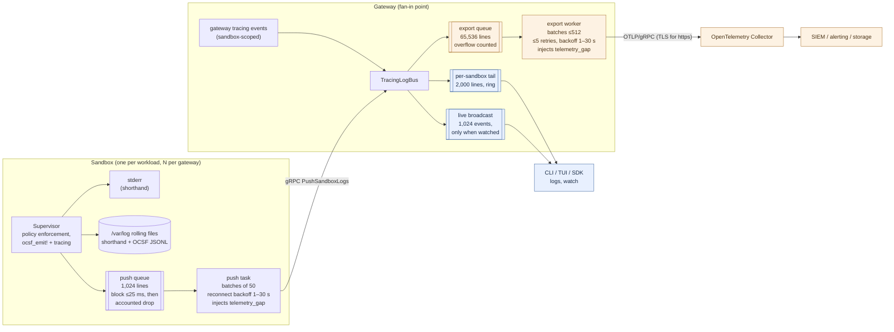
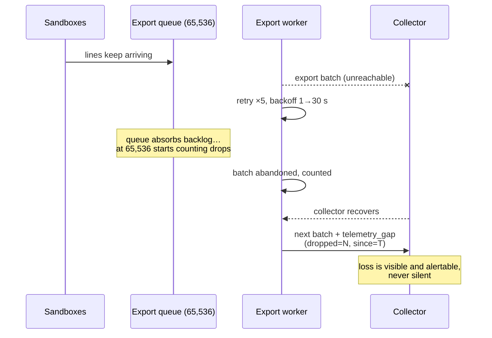

# Logging & Observability

This is the canonical overview of how operational telemetry — logs, OCSF
security events, traces, and metrics — moves through OpenShell: what is
collected, where it flows, what delivery guarantees each hop makes, and how to
choose a configuration. If you are deciding how to get security telemetry out
of OpenShell and into your collector or SIEM, start here.

> **Not to be confused with product telemetry.** OpenShell also emits
> anonymous, aggregate product-usage telemetry (opt-out, documented in the
> [main README](../README.md#telemetry)). This document is about *your*
> operational and security data: sandbox logs, policy decisions, and security
> events. That data goes only where you configure it to go.

## The model: visibility and export are different products

Every log line in OpenShell serves two different consumers with different
needs, and the pipeline treats them as two planes with different guarantees:

- **Visibility** is a human watching now: `openshell logs -f`, the TUI
  dashboard, `WatchSandbox` over the SDK. It needs low latency and bounded
  memory, and it is fine with history falling off the back — an operator
  tailing a sandbox does not need last week's lines. Visibility surfaces are
  **bounded ring buffers, lossy by design**.

- **Export** is a machine keeping records: an OpenTelemetry Collector feeding
  a SIEM, alerting, or long-term storage. Security telemetry must never
  vanish *silently*, so the export plane is **accountable**: any record it
  drops — and under a long collector outage it will prefer bounded memory over
  unbounded buffering — is counted and reported downstream as a synthetic
  `telemetry_gap` record. Loss is possible; invisible loss is not.

Both planes are fed by the same fan-in point: every line from every sandbox,
and every sandbox-scoped event the gateway itself emits, converges on the
gateway's log bus before splitting into the two planes.

## Signals at a glance

| Signal | Origin | Local surfaces | Off-box path |
|---|---|---|---|
| Plain logs (`tracing`) | Sandbox supervisor and gateway | stderr, rolling files in the sandbox; gateway stdout | Pushed to gateway, exported as OTLP log records when `export_logs` is on |
| OCSF security events (v1.7.0) | Sandbox supervisor (network/HTTP/SSH/process/findings/config) | Human-readable shorthand in the log stream; full-fidelity JSONL file in the sandbox | Same push/export path, with structured `ocsf.*` payload and severity-ranked records |
| Traces (spans) | Gateway request handling, store and driver operations | — | OTLP/gRPC when `[openshell.gateway.otlp]` is configured (best-effort) |
| Metrics | Gateway | Prometheus `/metrics` endpoint | Scraped; not exported over OTLP today |

## Data flow

Blue is the visibility plane (bounded, lossy by design); orange is the export
plane (bounded, accountable). Note the shape of the system: sandboxes fan **in**
to one gateway, and the gateway's export worker is the single stage every
exported line must pass through. That makes the export worker the natural
bottleneck and the thing to size deployments around — see
[Performance model](#performance-model-and-bottlenecks).

## Delivery guarantees, hop by hop

| Hop | Buffer | When it drops | What happens on drop |
|---|---|---|---|
| Supervisor → push queue | 1,024 lines | Queue full for >25 ms (`OPENSHELL_LOG_PUSH_BLOCK_MS`) | Counted; next pushed batch carries a `telemetry_gap` line with the count |
| Push task → gateway | batches of 50 over gRPC | Connection loss | Nothing dropped; task reconnects with 1–30 s backoff while the queue absorbs (then accounts) the backlog |
| Bus → tail / broadcast (visibility) | 2,000-line ring / 1,024-event channel | Always, eventually — rings evict oldest | By design; not accounted |
| Bus → export queue | 65,536 lines | Queue full (collector outage or sustained overload) | Counted; next successful export carries a `telemetry_gap` record (`dropped`, `dropped.since_ms`) |
| Export worker → collector | batches ≤512 | A batch fails 5 attempts (backoff 1 s→30 s) | Whole batch counted into the same `telemetry_gap` accounting; the stream continues — one poison batch cannot dam it |
| Gateway shutdown | — | Worker cannot flush within 5 s | Remaining queue is lost (see [Known gaps](#known-gaps)) |

The `telemetry_gap` records are the load-bearing invariant: **alert on them.**
One anywhere in the stream means telemetry was lost between production and your
collector, and says exactly how much and since when. The sandbox emits them as
log lines (`target=telemetry_gap`); the gateway emits them as OTLP records
(`log.target=telemetry_gap`, WARN severity).

How the export plane behaves through a collector outage:

## OCSF payload shapes: `flat` vs `raw`

OCSF events are the expensive lines, and the shape they travel in is the main
performance lever. Each event is pushed with a human-readable shorthand message
plus structured fields in one of two shapes, selected per sandbox with
`OPENSHELL_OCSF_PUSH_FORMAT`:

- **`flat`** (default): the event schema flattened into ~46 dotted `ocsf.*`
  attributes (`ocsf.dst_endpoint.port`, `ocsf.actor.process.name`, …).
  Records arrive query-ready — a SIEM matches fields directly — but every
  stage pays per attribute, and individual values are truncated at 256
  characters.

- **`raw`**: the complete OCSF document as a single `ocsf.raw` JSON attribute,
  with `ocsf.severity_id` beside it so gateway severity ranking is identical.
  Nothing is flattened, joined, or truncated — this is *higher* fidelity than
  `flat` — and it is 4–10× cheaper at every stage. The collector restores
  field-level structure downstream with a transform (OTTL `ParseJSON`); the
  exact processor config is in the
  [gateway config reference](../docs/reference/gateway-config.mdx).

In both shapes, `ocsf.severity_id` sets the OTLP record's severity, so a
blocked nonce replay outranks a routine policy load and "medium and above"
stays expressible in collector routing. Separately,
`ocsf_full_payload` in the gateway's OTLP table gates whether the OCSF payload
(either shape) leaves the gateway at all — with it off, only the shorthand
summary and severity export.

## Performance model and bottlenecks

The rule that explains almost every number below: **per-record cost is
dominated by attribute count, not payload bytes.** A 2 KB event as one
attribute is far cheaper than the same event as 46 attributes, at every stage.

Measured on commodity dev hardware
(`cargo bench --bench event_rendering --bench log_fanin --bench log_export`),
for a production-sized policy denial:

| Stage | `flat` (46 attrs) | `raw` | Plain line |
|---|---|---|---|
| Sandbox: render event | 21 µs | 10 µs | ~1 µs |
| Gateway: fan-in publish (per line) | 4.5 µs | 0.4 µs | 0.16 µs |
| Gateway: export conversion (per line) | 1.6 µs | 0.26 µs | 0.28 µs |
| **Gateway: export drain ceiling** | **~68 K lines/s** | **~289 K lines/s** | ~1.7 M lines/s |

How to read this for capacity planning:

- **Sandbox cost scales out; gateway cost does not.** Rendering happens in
  each sandbox and is charged to the workload that triggered the event (a
  denied connection pays for its own audit record). The gateway's fan-in bus
  and export worker are shared: their ceilings bound the whole deployment.
- **The export worker is the bottleneck stage.** Fan-in sustains hundreds of
  thousands of lines per second across concurrent sandboxes; export drains
  ~68 K/s in `flat` and ~289 K/s in `raw`. Estimate your aggregate OCSF
  lines/second across every sandbox one gateway serves and compare to the
  ceiling for your shape.
- **The scaling levers, in order:** switch busy fleets to `raw`; then add
  gateways. Also check collector capacity — the bench numbers stop at the
  exporter boundary, so wire encoding and a slow collector reduce them.
- **The signal is built in.** When the aggregate rate passes the ceiling,
  `telemetry_gap` records appear in your collector. That is the "scale up
  or change shape" alarm, not a hint buried in gateway logs.
- These numbers move with hardware; re-run the benches on representative
  machines for real sizing.

## Choosing a configuration

| Scenario | What to set | What you get |
|---|---|---|
| Local development | Nothing (no `[openshell.gateway.otlp]` table) | stderr + rolling files in each sandbox, `openshell logs` / TUI via the gateway. No off-box export. |
| Traces only | `[openshell.gateway.otlp] endpoint = "…"` | Distributed traces to your collector; logs stay on the visibility plane. |
| SIEM, query-ready records | Add `export_logs = true`, `ocsf_full_payload = true` (default `flat` shape) | Every line off-box as OTLP records; OCSF events carry matchable `ocsf.*` fields. Ceiling ~68 K lines/s per gateway. |
| High-scale fleet / busy sandboxes | Same, plus `OPENSHELL_OCSF_PUSH_FORMAT=raw` on sandboxes and a `ParseJSON` transform in the collector | Full-fidelity OCSF at ~4× the export ceiling and ~2× cheaper sandboxes. |
| Minimal export volume | `export_logs = true`, `ocsf_full_payload = false` | Shorthand summaries with correct severity ranking; structured OCSF payload stays on the box (JSONL file remains available). |

Full knob-by-knob reference, including TLS behavior, `OTEL_*` environment
variables, and Helm rendering: [gateway config
reference](../docs/reference/gateway-config.mdx) and the [OTLP export section
of the gateway architecture doc](gateway.md#otlp-export).

## Known gaps

- **Crash durability.** A clean shutdown flushes the export queue (bounded at
  5 s), but records in memory when the gateway *crashes* are lost and not
  accounted. The designed fix is a disk-backed spool with acknowledged
  checkpoints between the queue and the exporter ("Phase 2"); it is not built.
- **Metrics are Prometheus-only.** No OTLP metrics pipeline; scrape
  `/metrics`.
- **Private CA collectors.** `https://` endpoints verify against public roots
  compiled into the binary. A collector fronted by a private CA needs a local
  collector in front of it.

## Where the code lives

- `crates/openshell-ocsf` — OCSF event types, builders, shorthand/JSONL
  formatters, `flat`/`raw` field rendering, tracing layers.
- `crates/openshell-supervisor-process/src/log_push.rs` — sandbox push queue,
  batching, reconnect, gap accounting.
- `crates/openshell-server/src/tracing_bus.rs` — gateway fan-in bus, tails,
  broadcast, export tap.
- `crates/openshell-server/src/log_export.rs` — export queue, worker, retries,
  gap accounting, severity mapping.
- `crates/openshell-otel` — shared OTLP exporter/provider construction, TLS.
- Benches: `event_rendering` (openshell-ocsf), `log_fanin` and `log_export`
  (openshell-server).
